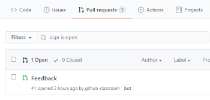

# Assignments with GitHub Classroom

1. I will send you the assignment URL, where you can accept the assignment
    - This will create a private GitHub repository just for you for this assignment
1. Clone this repository to your computer (guide [here](working-with-git.md))
1. This new directory on your computer is called your *local repo*. Open this directory in VSCode.
1. Read the assignment notes on GitHub (this is the `README.md` file).
1. Commit your changes and push them to GitHub regularly (guide [here](working-with-git.md))
1. If you want feedback at any point, push your changes and leave a comment with any questions or notes for me on the Feedback pull request on GitHub and I will reply. You can find this on the *Pull requests* tab on GitHub (see screeenshot below)

    

1. The assignment will have a deadline so just make sure your changes are on GitHub before then and I will be able to see them.
